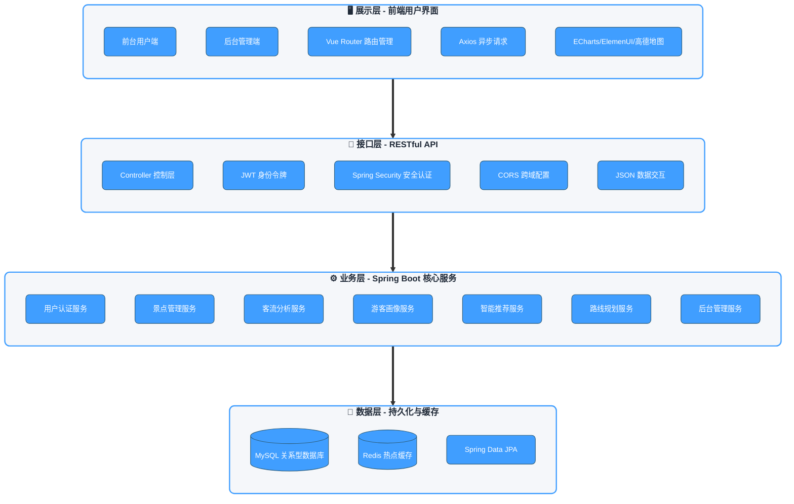

```mermaid
graph TD
    subgraph Presentation_Layer [🖥️ 展示层 - 前端用户界面]
        direction TB
        P1[前台用户端]
        P2[后台管理端]
        P3[Vue Router 路由管理]
        P4[Axios 异步请求]
        P5[ECharts/ElemenUI/高德地图]
    end

    subgraph Interface_Layer [🔌 接口层 - RESTful API]
        direction TB
        I1[Controller 控制层]
        I2[JWT 身份令牌]
        I3[Spring Security 安全认证]
        I4[CORS 跨域配置]
        I5[JSON 数据交互]
    end

    subgraph Business_Layer [⚙️ 业务层 - Spring Boot 核心服务]
        direction TB
        B1[用户认证服务]
        B2[景点管理服务]
        B3[客流分析服务]
        B4[游客画像服务]
        B5[智能推荐服务]
        B6[路线规划服务]
        B7[后台管理服务]
    end

    subgraph Data_Layer [💾 数据层 - 持久化与缓存]
        direction TB
        D1[(MySQL 关系型数据库)]
        D2[(Redis 热点缓存)]
        D3[Spring Data JPA]
    end

    %% 层级之间的连接
    Presentation_Layer ===> Interface_Layer
    Interface_Layer ===> Business_Layer
    Business_Layer ===> Data_Layer

    %% 样式定义 - 统一所有矩形样式
    classDef layerStyle fill:#f5f7fa,stroke:#409EFF,stroke-width:2px,color:#1f2937,font-weight:bold,font-size:14px,rx:8px,ry:8px
    classDef nodeStyle fill:#409EFF,stroke:#2d5f7e,stroke-width:1px,color:#FFFFFF,font-size:12px,font-weight:normal,rx:6px,ry:6px
    
    %% 应用样式到各层
    class Presentation_Layer,Interface_Layer,Business_Layer,Data_Layer layerStyle
    
    %% 应用样式到所有节点
    class P1,P2,P3,P4,P5 nodeStyle
    class I1,I2,I3,I4,I5 nodeStyle
    class B1,B2,B3,B4,B5,B6,B7 nodeStyle
    class D1,D2,D3 nodeStyle
```