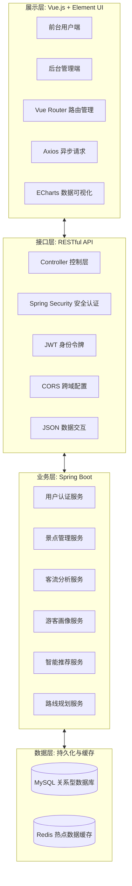

```mermaid
graph TD
    subgraph Presentation_Layer [展示层: Vue.js + Element UI]
        User_Terminal[前台用户端]
        Admin_Terminal[后台管理端]
        Vue_Router[Vue Router 路由管理]
        Axios[Axios 异步请求]
        ECharts[ECharts 数据可视化]
    end

    subgraph Interface_Layer [接口层: RESTful API]
        Controller[Controller 控制层]
        Spring_Security[Spring Security 安全认证]
        JWT[JWT 身份令牌]
        CORS[CORS 跨域配置]
        JSON[JSON 数据交互]
    end

    subgraph Business_Layer [业务层: Spring Boot]
        Auth_Service[用户认证服务]
        Scenic_Service[景点管理服务]
        Traffic_Service[客流分析服务]
        Profile_Service[游客画像服务]
        Recommend_Service[智能推荐服务]
        Route_Service[路线规划服务]
    end

    subgraph Data_Layer [数据层: 持久化与缓存]
        MySQL[("MySQL 关系型数据库")]
        Redis[("Redis 热点数据缓存")]
    end

    Presentation_Layer <--> Interface_Layer
    Interface_Layer <--> Business_Layer
    Business_Layer <--> Data_Layer

    classDef presentation fill:#E8F4FD,stroke:#409EFF,stroke-width:2px,color:#2c3e50,width:12px,height:60px
    classDef interface fill:#FFF7E6,stroke:#E6A23C,stroke-width:2px,color:#2c3e50,width:120px,height:60px
    classDef business fill:#ECF5E8,stroke:#67C23A,stroke-width:2px,color:#2c3e50,width:120px,height:60px
    classDef data fill:#F5F0FA,stroke:#8C6BCF,stroke-width:2px,color:#2c3e50,width:120px,height:60px
```